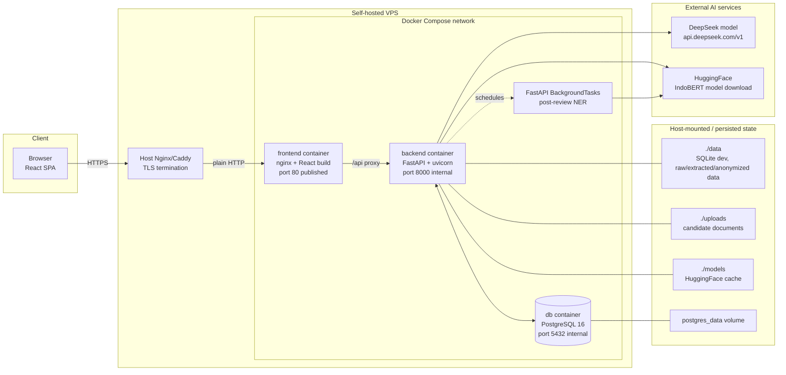

# Architecture

> Snapshot of the ScreenAI Lab system as of the current `main` branch.
>
> Product-level source of truth: [PRD.md](../PRD.md). Deployment source of truth: [DEPLOYMENT.md](DEPLOYMENT.md).

---

## 1. Overview

**ScreenAI Lab** is the AI-powered recruitment screening system for the **MBC Laboratory, Telkom University**. It replaces a manual recruiting workflow with:

- A **candidate self-service portal**: registration → profile → multi-document upload → review → submit.
- A **phase-aware recruitment period**: `UPCOMING → SUBMISSION → EVALUATION → ANNOUNCEMENT → CLOSED`.
- A **post-document-review anonymization pipeline**: CV + Motivation Letter are anonymized through IndoBERT NER only after recruiter/super_admin finalizes document review as accepted.
- A **rubric-augmented LLM scoring pipeline**: cached anonymized candidate text, KHS summary, Motivation Letter, and division rubric are sent to the configured DeepSeek model for structured scoring.
- A **recruiter / super-admin console**: filtering, evaluation, re-evaluation, score override, threshold highlight, manual checklist, and bulk announcement.

The repo was forked from the Capstone project [`istgrudd/screenai`](https://github.com/istgrudd/screenai). Legacy Capstone endpoints (`POST /api/upload`, `POST /api/evaluate`) remain mounted for compatibility, but the Lab pipeline is the primary path.

| Phase | Description | Status |
|---|---|---|
| 0 | Fork & cleanup | ✅ Complete |
| 1 | Candidate Portal MVP | ✅ Complete |
| 2 | Full Recruitment Flow | ✅ Complete |
| 3 | Docker/VPS deployment | 🔄 In Progress — assets ready, production cutover pending |

---

## 2. High-Level Architecture

Production is designed for a **single self-hosted VPS** using Docker Compose. TLS is terminated by a host-level reverse proxy outside Docker.



Runtime path:

```text
browser HTTPS -> host Nginx/Caddy -> frontend container :80
                                        ├─ serve React SPA
                                        └─ /api -> backend container :8000 -> db container :5432
```

Key data paths:

1. **Document review gate**: `submit_application` commits the application into `document_review`; recruiter/super_admin reviews every required document and finalizes the application as either `verified` or `correction_requested`.
2. **Post-review NER**: accepted finalization schedules a background task that opens its own `SessionLocal`, extracts CV + Motivation Letter, anonymizes text, and caches it in `candidate_documents.anonymized_text`. Rejected finalization does not run NER.
3. **Evaluation**: recruiter triggers `POST /api/recruiter/evaluate/batch`; the pipeline targets `verified` applications, checks NER cache, falls back to inline NER when needed, parses KHS, validates KTM, builds a rubric-augmented prompt, awaits the async DeepSeek client, persists `DimensionScore`, and updates `Candidate.composite_score`.
4. **Phase derivation**: `backend/utils/period_utils.py::get_current_phase` derives the active phase from calendar boundaries. No cron/scheduler is required.
5. **Auth hardening**: password reset, admin reset-link completion, and authenticated profile password updates set `users.password_changed_at`; protected requests reject JWTs issued before that timestamp.
6. **Announcements and notifications**: recruiter selects passing applications and calls `POST /api/announcements/bulk`; the backend updates pass/fail statuses atomically, writes `AuditLog` rows, and records non-blocking workflow email notification metadata.

---

## 3. Deployment Model

### Canonical production path

| Component | Production runtime | Notes |
|---|---|---|
| Frontend | Docker container built from `frontend/Dockerfile` | nginx serves SPA and proxies `/api/` to backend service |
| Backend | Docker container built from `backend/Dockerfile` | `uvicorn backend.main:app --host 0.0.0.0 --port 8000` |
| Database | Docker Compose service `db` | `postgres:16-alpine`, internal hostname `db` |
| TLS | Host OS, outside Docker | Nginx/Caddy terminates HTTPS and forwards to frontend container port 80 |
| Migrations | Backend lifespan | `alembic upgrade head` runs on FastAPI startup |
| Rubric seeding | Backend lifespan | one empty rubric per division, idempotent |

Manual `uvicorn` via systemd/supervisor is not the recommended production path anymore. It can still be used for local experiments or emergency fallback, but Docker Compose is the canonical deployment documented in [DEPLOYMENT.md](DEPLOYMENT.md).

### Important production env values

```env
ENVIRONMENT=production
SECRET_KEY=<strong random value>
ALLOWED_ORIGINS=https://recruitment.mbclaboratory.com
DEEPSEEK_API_KEY=<key>
DATABASE_URL=postgresql://screenai:<password>@db:5432/screenai_lab
POSTGRES_USER=screenai
POSTGRES_PASSWORD=<same password>
POSTGRES_DB=screenai_lab
VITE_API_BASE_URL=/api
RESEND_API_KEY=<key>
EMAIL_FROM="MBC Laboratory <noreply@mail.mbclaboratory.com>"
PUBLIC_FRONTEND_URL=https://recruitment.mbclaboratory.com
EMAIL_ENABLED=true
EMAIL_VERIFICATION_EXPIRE_MINUTES=60
EMAIL_RESEND_COOLDOWN_SECONDS=60
PASSWORD_RESET_EXPIRE_MINUTES=60
PASSWORD_RESET_COOLDOWN_SECONDS=60
```

Notes:

- `DATABASE_URL` must use `db` as hostname in Docker Compose, not `localhost`.
- The production app origin is expected to be `https://recruitment.mbclaboratory.com`; the main domain `mbclaboratory.com` can host the laboratory website or a future app portal.
- Verification and reset-password links should be frontend-facing: `/verify-email?code=...` and `/reset-password?code=...`.
- Backend email templates build those links from `PUBLIC_FRONTEND_URL`; do not point production UX directly at backend JSON endpoints.
- `VITE_API_BASE_URL=/api` is recommended for the same-subdomain Docker deployment where frontend nginx proxies `/api` to the backend.
- `EMAIL_FROM` must match a domain verified in Resend. Resend delivers email; ScreenAI Lab backend owns verification/reset token generation and validation.
- `VITE_API_BASE_URL` is build-time. Rebuild the frontend when it changes.
- TLS is intentionally outside Docker so cert renewal is independent from app containers.

---

## 4. Directory Tree

Annotated view of meaningful paths:

```text
screenai-lab/
├── README.md                 — quick start + canonical deployment summary
├── PRD.md                    — product requirements and phase status
├── CLAUDE.md                 — execution plan / implementation roadmap
├── docker-compose.yml        — canonical VPS deployment topology
├── .env.example              — local dev + Docker/VPS production env template
├── requirements.txt          — Python dependencies
├── alembic.ini               — Alembic config
│
├── backend/
│   ├── Dockerfile            — backend image (Python 3.11 slim)
│   ├── main.py               — FastAPI app entry, lifespan, CORS, router registration
│   ├── config.py             — pydantic-settings Settings
│   ├── database.py           — SQLAlchemy engine/session + Alembic auto-upgrade
│   │
│   ├── alembic/              — migration environment + version files
│   │
│   ├── middleware/
│   │   ├── auth_middleware.py — bearer JWT + require_role
│   │   └── rate_limit.py      — slowapi key function / limiter
│   │
│   ├── models/
│   │   ├── user.py            — User + UserRole
│   │   ├── email_verification.py — one-time email verification links
│   │   ├── password_reset.py    — one-time password reset links
│   │   ├── application.py     — Application + status/division enums
│   │   ├── document.py        — Document + DocumentType
│   │   ├── candidate.py       — Candidate, CandidateDocument, DimensionScore
│   │   ├── rubric.py          — Rubric + Dimension
│   │   ├── period.py          — RecruitmentPeriod + current_phase property
│   │   ├── audit.py           — AuditLog
│   │   └── email_notification.py — EmailNotification delivery log
│   │
│   ├── routers/
│   │   ├── auth.py            — register / login / verify / forgot-reset / me / admin reset
│   │   ├── users.py           — self-service profile + super-admin user management
│   │   ├── applications.py    — application CRUD + submit + document-review finalization + recruiter list
│   │   ├── documents.py       — upload / list / download / review/verify
│   │   ├── periods.py         — RecruitmentPeriod CRUD + active stats
│   │   ├── rubrics.py         — rubric CRUD
│   │   ├── candidates.py      — candidate detail + score override + history
│   │   ├── evaluate_batch.py  — division-based batch evaluation
│   │   ├── evaluation.py      — deprecated legacy /api/evaluate
│   │   ├── upload.py          — deprecated legacy /api/upload
│   │   ├── analytics.py       — active-period recruitment analytics
│   │   ├── audit_logs.py      — super-admin audit listing
│   │   ├── email_notifications.py — super-admin email notification log listing
│   │   └── announcements.py   — individual + bulk announce + candidate result
│   │
│   ├── services/
│   │   ├── auth_service.py         — JWT + password auth
│   │   ├── email_service.py        — Resend abstraction + disabled mode
│   │   ├── email_templates.py      — hardcoded transactional email templates
│   │   ├── email_verification_service.py — candidate verification flow
│   │   ├── password_reset_service.py — reset code generation, hashing, email, password update
│   │   ├── extractor.py            — PyMuPDF PDF extraction + EPrT helper
│   │   ├── normalizer.py           — text cleanup + section segmentation
│   │   ├── anonymizer.py           — NER + regex anonymization
│   │   ├── khs_parser.py           — KHS parser
│   │   ├── ktm_validator.py        — KTM validator
│   │   ├── document_review_service.py — document verification/rejection/correction rules
│   │   ├── notification_service.py   — non-blocking workflow notification logging/sending
│   │   ├── submit_anonymization.py — BackgroundTask post-review processing
│   │   ├── evaluation_service.py   — full evaluation orchestration
│   │   ├── rag_pipeline.py         — rubric-augmented prompt + DeepSeek JSON parsing
│   │   ├── scoring.py              — persist scores + validate weights
│   │   ├── rubric_seeding.py       — idempotent division-rubric seed
│   │   └── xai.py                  — future formal XAI module stub
│   │
│   └── utils/
│       ├── llm_client.py           — DeepSeek OpenAI-compatible client
│       ├── security.py             — bcrypt helpers
│       ├── period_utils.py         — pure phase derivation
│       └── file_storage.py         — upload validation + persistence helpers
│
├── frontend/
│   ├── Dockerfile            — Vite build + nginx runtime
│   ├── nginx.conf            — SPA static serving + /api proxy
│   ├── package.json          — React 19 + Vite 8 + Tailwind 4
│   └── src/
│       ├── App.jsx           — BrowserRouter + role-aware route tree
│       ├── lib/              — API/auth/phase/utils helpers
│       ├── components/       — protected route, upload step, phase card, UI primitives
│       └── pages/            — candidate, recruiter, admin pages
│
├── docs/
│   ├── DEPLOYMENT.md         — canonical Docker/VPS deployment guide
│   ├── ARCHITECTURE.md       — this file
│   ├── API_REFERENCE.md      — endpoint reference
│   ├── MODULE_ANALYSIS.md    — module notes
│   ├── FLOW_DIAGRAMS.md      — Mermaid diagrams
│   └── reports/              — batch reports / cleanup reports
│
├── data/                     — local/manual runtime state (gitignored)
├── uploads/                  — candidate uploads in local/manual runs (gitignored)
├── models/                   — HuggingFace cache (gitignored)
└── scripts/                  — smoke tests + helper scripts
```

---

## 5. Tech Stack

### Backend

| Package | Role |
|---|---|
| FastAPI | HTTP framework + dependency injection |
| Uvicorn | ASGI server inside backend container |
| SQLAlchemy | ORM |
| Alembic | Schema migrations, auto-run on startup |
| Pydantic / pydantic-settings | Request/response validation + env config |
| python-jose | JWT encode/decode |
| bcrypt | Password hashing |
| slowapi | Rate limiting |
| PyMuPDF | PDF text extraction |
| OpenAI SDK | DeepSeek OpenAI-compatible sync and async clients |
| transformers + torch | IndoBERT NER pipeline |
| LangChain + ChromaDB | Dependencies available for future vector retrieval; not active retrieval path today |
| psycopg2-binary | PostgreSQL driver |

### Frontend

| Package | Role |
|---|---|
| React / React DOM | UI framework |
| React Router | Client-side routing |
| Vite | Dev server + production bundler |
| Tailwind CSS | Utility CSS |
| shadcn/radix-ui | UI primitives |
| lucide-react | Icons |
| sonner | Toast notifications |
| recharts | Charts in candidate detail |

### AI / ML Pipeline

| Component | Default config |
|---|---|
| LLM | `deepseek-v4-flash`, temperature `0.1`, max 4096 tokens, 3 retries |
| NER | `ageng-anugrah/indobert-large-p2-finetuned-ner` |
| Embeddings | `sentence-transformers/all-MiniLM-L6-v2` |
| Vector store | ChromaDB at `CHROMA_PERSIST_DIR`; reserved/future retrieval |
| PDF extraction | PyMuPDF `page.get_text("text")` |

---

## 6. External Services & Integrations

### DeepSeek LLM

- **Endpoint:** `DEEPSEEK_BASE_URL`, default `https://api.deepseek.com/v1`.
- **Auth:** `DEEPSEEK_API_KEY`.
- **Client:** OpenAI-compatible SDK wrapper in `backend/utils/llm_client.py`; batch evaluation uses the `AsyncOpenAI` path.
- **Used by:** `backend/services/rag_pipeline.py` for rubric-augmented JSON scoring.

### HuggingFace Transformers

- **Model:** `NER_MODEL_NAME`, default `ageng-anugrah/indobert-large-p2-finetuned-ner`.
- **Cache:** `./models/ner` by default.
- **Runtime:** first NER/evaluation call may download the model; Docker deployment mounts `./models` so restarts reuse the cache.

### ChromaDB

- **Persistence:** `CHROMA_PERSIST_DIR`, default `./backend/vectorstore`.
- **Current status:** dependency exists and directory is created, but evaluation currently inlines rubric context directly into the LLM prompt.

---

## 7. Environment Variables

Variables are defined in `.env.example`. Backend variables are read by `backend/config.py`; frontend variables prefixed with `VITE_` are inlined by Vite at build time.

| Variable | Scope | Production note |
|---|---|---|
| `ENVIRONMENT` | backend | Set to `production` to activate startup guards |
| `SECRET_KEY` | backend | Strong random JWT signing key; placeholder refused in production |
| `ALLOWED_ORIGINS` | backend | Required in production; recommended app origin `https://recruitment.mbclaboratory.com` |
| `DATABASE_URL` | backend | Docker prod: `postgresql://USER:PASSWORD@db:5432/DBNAME` |
| `POSTGRES_USER` | db | Must match `DATABASE_URL` |
| `POSTGRES_PASSWORD` | db | Must match `DATABASE_URL` |
| `POSTGRES_DB` | db | Must match `DATABASE_URL` |
| `DEEPSEEK_API_KEY` | backend | Required for evaluation calls |
| `VITE_API_BASE_URL` | frontend build | Same-subdomain Docker path: `/api`; rebuild when changed |
| `FRONTEND_URL` | backend | Dev CORS fallback when `ALLOWED_ORIGINS` empty |
| `RESEND_API_KEY` | backend | Required only when transactional email sending is enabled |
| `EMAIL_FROM` | backend | Required only when transactional email sending is enabled; must match a Resend-verified sender domain |
| `PUBLIC_FRONTEND_URL` | backend | Public frontend origin used in email verification and password reset links |
| `EMAIL_ENABLED` | backend | Keep `false` for local smoke tests; set `true` after email config is valid |
| `EMAIL_VERIFICATION_EXPIRE_MINUTES` | backend | Candidate verification code TTL |
| `EMAIL_RESEND_COOLDOWN_SECONDS` | backend | Candidate verification resend cooldown |
| `PASSWORD_RESET_EXPIRE_MINUTES` | backend | Password reset code TTL |
| `PASSWORD_RESET_COOLDOWN_SECONDS` | backend | Forgot-password request cooldown |
| `CHROMA_PERSIST_DIR` | backend | Optional override |
| `NER_MODEL_NAME` | backend | Optional override |
| `EMBEDDING_MODEL_NAME` | backend | Optional override |

---

Phase 12 implementation note: `applications.py` now owns final submit and document-review finalization, `documents.py` owns per-document review/verify operations, `document_review_service.py` owns verification/rejection/correction rules, `analytics.py` and `audit_logs.py` expose recruiter/admin observability, and `email_notifications.py` exposes the read-only Admin Emails monitoring endpoint. `submit_anonymization.py` now runs after accepted document-review finalization, not at candidate submit time.

## 8. Data Flow at a Glance

1. **Sign-up & profile**: Candidate registers → email verification link issued → verified candidate can log in and receive a JWT.
2. **Application creation**: Candidate selects division → `POST /api/applications` creates a `DRAFT` application.
3. **Document uploads**: Six required document types are uploaded through `/api/documents/upload/{doc_type}` with size, MIME, and magic-byte validation.
4. **Submit gate**: Submission requires a complete profile, an active period in `SUBMISSION`, and all required documents. Status flips to `document_review`, file mutations are locked, and an `application_submitted` notification is logged.
5. **Document review**: Recruiter/super_admin verifies or rejects each required document. Candidate-facing document decisions are masked until review finalization.
6. **Correction or accepted finalization**: Rejected finalization moves the application to `correction_requested` and logs/sends `document_rejected`; accepted finalization moves it to `verified` and queues NER.
7. **Post-review NER**: BackgroundTask extracts/anonymizes CV + Motivation Letter and caches results for verified applications.
8. **Recruiter evaluation**: Batch evaluation targets `verified` applications, checks cache, parses KHS, validates KTM, builds prompt, calls DeepSeek, stores scores, and moves application to `screening`. `force=true` can re-evaluate `screening`.
9. **Bulk publish**: Backend updates pass/fail statuses atomically, writes audit logs, and logs/sends `announcement_published`.
10. **Candidate result**: Candidate status/result page reads announcement status.

---

## 9. Storage Layout

### Local/manual runtime

```text
data/
├── screenai_lab.db       # SQLite dev DB
├── raw_pdfs/             # legacy Capstone PDF dump
├── extracted/            # extracted JSON
└── anonymized/           # anonymized JSON

uploads/
└── {application_id}/
    ├── cv.pdf
    ├── khs.pdf
    ├── ktm.{pdf|jpg|png}
    ├── motivation_letter.pdf
    ├── swot.pdf
    └── supporting_docs.pdf

models/ner/               # HuggingFace cache
backend/vectorstore/      # ChromaDB directory
```

### Docker production

- PostgreSQL data is stored in the `postgres_data` Docker volume.
- `./data` is mounted into `/app/data` for legacy raw/extracted/anonymized artifacts.
- `./uploads` is mounted into `/app/uploads`, matching `settings.upload_dir = "./uploads"`, so candidate-submitted documents survive backend container recreation.
- `./models` is mounted into `/app/models` for the HuggingFace model cache.

---

## 10. Known Limitations

- Formal `xai.py` implementation is still future work; current explanations come from stored LLM justifications.
- Current scoring path is rubric-augmented prompting, not live vector retrieval.
- OCR for scanned PDFs/images is not part of the main pipeline yet.
- JWT is stored in localStorage; HttpOnly cookie + CSRF is a security backlog.
- Frontend forgot/reset password pages are not implemented yet; Phase 4 exposes backend endpoints only.
- Horizontal scaling would require shared file storage and shared rate-limit state.

---

## 11. Related Documents

- [PRD.md](../PRD.md) — product requirements and phase status.
- [DEPLOYMENT.md](DEPLOYMENT.md) — canonical Docker/VPS deployment guide.
- [API_REFERENCE.md](API_REFERENCE.md) — endpoint reference.
- [FLOW_DIAGRAMS.md](FLOW_DIAGRAMS.md) — Mermaid diagrams.
- [reports/DOCKER_SETUP_REPORT.md](reports/DOCKER_SETUP_REPORT.md) — Docker setup implementation notes.
- [reports/RAILWAY_VERCEL_CLEANUP_REPORT.md](reports/RAILWAY_VERCEL_CLEANUP_REPORT.md) — migration context from cloud PaaS to self-hosted VPS.
