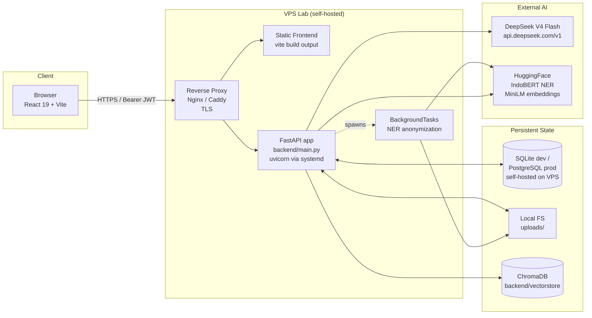

# Architecture

> Snapshot of the ScreenAI Lab system as of branch `lab/setup`, commit `9060bc56f1f8` (build date 2026-05-08).

---

## 1. Overview

**ScreenAI Lab** is the AI-powered recruitment screening system for the **MBC (Multimedia & Business Computing) Laboratory** at Telkom University. It replaces a manual, paper-driven recruiting cycle for four divisions (Big Data, Cyber Security, Game Technology, GIS) with:

- A **candidate self-service portal** (registration → profile → multi-document upload → review → submit).
- An **AI evaluation pipeline** that anonymizes CVs (IndoBERT NER), parses transcripts (KHS), validates student IDs (KTM), and scores against a configurable per-division rubric using **DeepSeek V4 Flash** with rubric context retrieval (RAG).
- A **recruiter / super-admin console** for filtering candidates by division, running batch evaluation, overriding individual scores, and bulk-publishing pass/fail results.
- A **time-boxed `RecruitmentPeriod`** with four explicit phases (`UPCOMING → SUBMISSION → EVALUATION → ANNOUNCEMENT → CLOSED`) that gates which actions are allowed when.

The repo was forked from the Capstone project [`istgrudd/screenai`](https://github.com/istgrudd/screenai). The legacy upload flow (`POST /api/upload`, `POST /api/evaluate`) is still mounted but is being phased out in favour of the Lab pipeline (`POST /api/applications/{id}/submit`, `POST /api/recruiter/evaluate/batch`). Phase status (per [CLAUDE.md](../CLAUDE.md)):

| Phase | Description | Status |
|---|---|---|
| 0 | Fork & cleanup | ✅ Complete |
| 1 | Candidate Portal MVP (Auth + Upload + Status + Admin) | ✅ Complete |
| 2 | Full Recruitment Flow (NER submit-time + Period + Evaluation + Selection) | 🔄 In Progress |
| 3 | Deployment (VPS lab / cloud) | 📋 Planned |

---

## 2. High-Level Architecture



Key data paths:

- **Submit-time NER:** `submit_application` commits the application, then schedules a `BackgroundTask` that runs IndoBERT NER on the candidate's CV + Motivation Letter and caches the anonymized text in `candidate_documents.anonymized_text`.
- **Evaluation:** the recruiter triggers `POST /api/recruiter/evaluate/batch` per division. The pipeline checks the cache, calls KHS parser + KTM validator, retrieves rubric context, builds a Bahasa Indonesia prompt, calls DeepSeek, persists `DimensionScore` rows, and updates `Candidate.composite_score`.
- **Phase derivation:** the active `RecruitmentPeriod` has `start_date`, `submission_end_date`, `evaluation_end_date`, `end_date`. `backend/utils/period_utils.py::get_current_phase` derives `UPCOMING / SUBMISSION / EVALUATION / ANNOUNCEMENT / CLOSED` purely from the calendar (never from `is_active`).

---

## 3. Directory Tree

Annotated view (only meaningful files / dirs).

```
screenai-lab/
├── README.md                — Setup + quick-start
├── PRD.md                   — Product requirements (Phase 1–3)
├── CLAUDE.md                — Execution plan (Phase 2 task breakdown)
├── AGENTS.md / GEMINI.md    — MCP code-review-graph usage notes (duplicates)
├── analysis.md              — Earlier codebase analysis
├── alembic.ini              — Alembic config (script_location = backend/alembic)
├── requirements.txt         — Python deps (22 packages)
├── runtime.txt              — `python-3.11` (Python version hint for buildpack-style tooling; informational on VPS)
├── .env.example             — 11 backend keys + 1 frontend key (VITE_RECRUITMENT_DEADLINE)
├── .gitignore               — Standard Python/Node + data/ + uploads/ + models/ + venv/
│
├── backend/
│   ├── main.py              — FastAPI app entry, lifespan, CORS, router registration
│   ├── config.py            — pydantic-settings Settings (loads .env)
│   ├── database.py          — SQLAlchemy engine, SessionLocal, Base, init_db (Alembic upgrade head)
│   │
│   ├── alembic/
│   │   ├── env.py           — Alembic runtime config
│   │   └── versions/        — 6 migration files (initial → phase dates → whatsapp)
│   │
│   ├── middleware/
│   │   └── auth_middleware.py — OAuth2 bearer extraction + require_role factory
│   │
│   ├── models/              — SQLAlchemy ORM models
│   │   ├── user.py          — User + UserRole enum (super_admin / recruiter / candidate)
│   │   ├── application.py   — Application + ApplicationStatus + Division enums
│   │   ├── document.py      — Document + DocumentType enum (CV/KHS/KTM/ML/SWOT/SUPPORTING_DOCS)
│   │   ├── candidate.py     — Candidate + CandidateDocument + DimensionScore (AI pipeline)
│   │   ├── rubric.py        — Rubric + Dimension
│   │   ├── period.py        — RecruitmentPeriod (with current_phase property)
│   │   └── audit.py         — AuditLog
│   │
│   ├── routers/             — FastAPI APIRouter modules
│   │   ├── auth.py          — register / login / logout / me
│   │   ├── users.py         — /me (self-service) + super-admin user mgmt
│   │   ├── applications.py  — Application CRUD + submit + recruiter list
│   │   ├── documents.py     — Document upload / list / download / verify
│   │   ├── periods.py       — RecruitmentPeriod CRUD + close
│   │   ├── rubrics.py       — Rubric CRUD
│   │   ├── candidates.py    — Candidate detail + score override + my-applications
│   │   ├── evaluate_batch.py — Division-based batch eval + per-app result
│   │   ├── evaluation.py    — Legacy /api/evaluate (rubric-based)
│   │   ├── upload.py        — Legacy /api/upload (Capstone CV+EPrT batch)
│   │   └── announcements.py — Per-app + bulk announce + GET /my
│   │
│   ├── services/            — Business logic
│   │   ├── auth_service.py            — JWT create/decode + authenticate_user
│   │   ├── extractor.py               — PyMuPDF PDF→text + EPrT certificate detection
│   │   ├── normalizer.py              — text cleanup + section segmentation (referenced)
│   │   ├── anonymizer.py              — NER + regex anonymization with indexed tokens
│   │   ├── ner_utils.py               — IndoBERT pipeline singleton (referenced)
│   │   ├── khs_parser.py              — IPK + course extraction from KHS PDF
│   │   ├── ktm_validator.py           — Rule-based KTM ID validation
│   │   ├── submit_anonymization.py    — Submit-time BackgroundTask (Task 10.1)
│   │   ├── evaluation_service.py      — run_evaluation_pipeline + _evaluate_one
│   │   ├── rag_pipeline.py            — Bahasa-Indonesia prompt + DeepSeek call + JSON validate
│   │   ├── scoring.py                 — Persist DimensionScores + CEFR map (EPrT bonus)
│   │   ├── rubric_seeding.py          — Idempotent seed of 4 empty division rubrics
│   │   └── xai.py                     — Phase 4 stub (TODO)
│   │
│   ├── utils/
│   │   ├── llm_client.py              — DeepSeek V4 Flash via OpenAI SDK (retry + JSON parse)
│   │   ├── security.py                — bcrypt hash_password / verify_password
│   │   ├── period_utils.py            — Pure get_current_phase(period, now) → phase literal
│   │   ├── file_storage.py            — save_upload / delete_stored_file + per-doc limits
│   │   ├── ner_utils.py               — IndoBERT pipeline (referenced)
│   │   └── pdf_utils.py               — PDF helpers (referenced)
│   │
│   └── vectorstore/         — ChromaDB persist dir (auto-created)
│
├── frontend/
│   ├── package.json         — React 19 + Vite 8 + Tailwind 4 + shadcn/ui
│   ├── vite.config.js       — React plugin + Tailwind plugin + `@` alias
│   ├── jsconfig.json        — `@/*` → `./src/*` for editor support
│   ├── eslint.config.js     — Flat config, ignores dist/
│   ├── components.json      — shadcn/ui registry
│   ├── index.html           — Root with #root + favicon
│   ├── .env.example         — VITE_RECRUITMENT_DEADLINE (currently unused)
│   │
│   └── src/
│       ├── main.jsx         — Entry; renders <App />
│       ├── App.jsx          — BrowserRouter + Sidebar + role-aware route tree
│       ├── index.css        — Tailwind + theme tokens (oklch)
│       │
│       ├── lib/
│       │   ├── api.js       — Single fetch wrapper + 30+ endpoint helpers
│       │   ├── auth.js      — JWT in localStorage + decodeJwt + role constants
│       │   ├── phase.js     — PHASES / labels / badge classes
│       │   └── utils.js     — cn() helper (clsx + tailwind-merge)
│       │
│       ├── components/
│       │   ├── ProtectedRoute.jsx       — Auth + role guard, 403 page
│       │   ├── RecruitmentPhaseCard.jsx — Phase timeline + countdown (consumes /periods/active)
│       │   ├── RecruitmentJourney.jsx   — Status-flow tracker for candidates
│       │   ├── DocumentUploadStep.jsx   — Single-doc step (drag-drop + validation)
│       │   ├── DocumentPreviewDialog.jsx — Modal blob viewer
│       │   ├── OverrideDialog.jsx       — Recruiter score override modal
│       │   ├── JustificationCard.jsx    — AI reasoning display
│       │   ├── SwotHighlightPanel.jsx   — SWOT text highlight
│       │   ├── StaffProfileForm.jsx     — Recruiter/admin profile form
│       │   └── ui/                      — shadcn/ui primitives (~20 files)
│       │
│       └── pages/
│           ├── LoginPage.jsx                   — Public login
│           ├── RegisterPage.jsx                — Public register (Telkom-style fields)
│           ├── DashboardPage.jsx               — Recruiter dashboard (filter+evaluate+publish)
│           ├── CandidateDetailPage.jsx         — Recruiter candidate detail
│           ├── RubricConfigPage.jsx            — Rubric CRUD (recruiter+admin)
│           ├── UploadPage.jsx                  — Legacy Capstone upload (off-nav)
│           ├── MyApplicationsPage.jsx          — Candidate history
│           │
│           ├── candidate/
│           │   ├── DashboardPage.jsx           — Candidate landing
│           │   ├── ProfilePage.jsx             — Profile + division select
│           │   ├── DocumentsPage.jsx           — 6-step upload wizard
│           │   ├── ReviewPage.jsx              — Final review + submit gate
│           │   ├── SubmittedPage.jsx           — Post-submit confirmation
│           │   └── ResultPage.jsx              — Pass/fail banner + scores
│           │
│           ├── recruiter/
│           │   └── ProfilePage.jsx             — Self-service profile
│           │
│           └── admin/
│               ├── AdminPage.jsx               — User management
│               ├── RecruitmentPeriodPage.jsx   — Period CRUD + close
│               └── ProfilePage.jsx             — Self-service profile
│
├── data/                    — Local-only state (gitignored)
│   ├── screenai_lab.db      — SQLite dev DB
│   ├── raw_pdfs/            — Legacy Capstone PDF input
│   ├── extracted/           — Raw extraction JSON
│   └── anonymized/          — Anonymized JSON
│
├── uploads/                 — Candidate uploads: {application_id}/{doc_type}.{ext}
│
└── scripts/                 — Smoke tests + seed scripts
    ├── seed_rubric.py
    ├── smoke_test_auth.py
    ├── smoke_test_applications.py
    ├── smoke_test_upload.py
    ├── smoke_test_evaluation.py
    ├── smoke_test_periods.py
    ├── smoke_test_bulk_announce.py
    ├── smoke_test_submit_ner.py
    ├── smoke_test_phase2_parsers.py
    ├── smoke_test_anonymize.py
    ├── integration_test_phase3.py
    ├── create_sample_cv.py
    └── check_db.py
```

> **Note:** A top-level `models/` directory exists at the repo root (separate from `backend/models/`). This is the HuggingFace cache target referenced by `Settings.ner_cache_dir = "./models/ner"` and is not part of the application source tree.

---

## 4. Tech Stack

### Backend (Python 3.11)

| Package | Version | Role |
|---|---|---|
| fastapi | ≥0.110 | HTTP framework + dependency injection |
| uvicorn[standard] | ≥0.29 | ASGI server (run on VPS, typically via systemd) |
| sqlalchemy | ≥2.0 | ORM (DeclarativeBase, Session) |
| alembic | ≥1.13 | Schema migrations (auto-run on startup) |
| pydantic | ≥2.0 | Schema validation (request/response) |
| pydantic-settings | ≥2.0 | `.env` → `Settings` |
| python-multipart | ≥0.0.9 | File upload parsing |
| python-jose[cryptography] | ≥3.3 | JWT encode/decode (HS256) |
| bcrypt | ==4.0.1 | Password hashing (pinned) |
| python-dotenv | ≥1.0 | `.env` loader |
| email-validator | ≥2.0 | EmailStr field type |
| psycopg2-binary | ≥2.9 | Postgres driver (self-hosted Postgres on VPS) |
| pymupdf | ≥1.24 | PDF text extraction (fitz) |
| openai | ≥1.0 | DeepSeek V4 Flash client (OpenAI-compat) |
| transformers | ≥4.40 | IndoBERT NER pipeline |
| torch | ≥2.2 | NER model backend |
| langchain / langchain-community / langchain-openai | ≥0.2 / ≥0.2 / ≥0.1 | RAG infra (some unused; reserved) |
| chromadb | ≥0.5 | Vector store (sentence-transformers/all-MiniLM-L6-v2) |

### Frontend (Node)

| Package | Version | Role |
|---|---|---|
| react / react-dom | ^19.2.4 | UI framework |
| react-router-dom | ^7.14.1 | Client-side routing |
| vite | ^8.0.4 | Dev server + bundler |
| @vitejs/plugin-react | ^6.0.1 | JSX transpile + fast refresh |
| tailwindcss / @tailwindcss/vite | ^4.2.2 | Utility CSS |
| shadcn / radix-ui | ^4.3 / ^1.4 | Component primitives |
| lucide-react | ^1.8 | Icon set |
| sonner | ^2.0.7 | Toast notifications |
| recharts | ^3.8.1 | Radar + bar charts (CandidateDetailPage) |
| clsx / tailwind-merge | ^2.1 / ^3.5 | `cn()` helper |
| class-variance-authority | ^0.7.1 | Variant typing |
| next-themes | ^0.4.6 | Theme support |
| @fontsource-variable/geist | ^5.2.8 | Variable font |
| eslint + plugins | ^9.39.4 | Linting (flat config) |

### AI / ML Pipeline

| Component | Source | Default config |
|---|---|---|
| LLM | DeepSeek V4 Flash via `openai` SDK | `deepseek-v4-flash`, temperature `0.1`, max 4096 tokens, 3 retries with exponential backoff |
| NER | IndoBERT NER fine-tune | `ageng-anugrah/indobert-large-p2-finetuned-ner` (HuggingFace) |
| Embeddings | sentence-transformers | `sentence-transformers/all-MiniLM-L6-v2` |
| Vector store | ChromaDB | persisted at `./backend/vectorstore` |
| PDF extraction | PyMuPDF (`fitz`) | `page.get_text("text")` |

### Infra / DevOps

| Concern | Tooling |
|---|---|
| Backend deploy | VPS lab (self-hosted) — `uvicorn backend.main:app` managed by systemd / supervisor, fronted by Nginx or Caddy with TLS. Healthcheck: `/api/health`. |
| Process spec | Operator-defined systemd unit (or supervisor.conf) running `uvicorn backend.main:app --host 127.0.0.1 --port 8000`. |
| Python pin | `runtime.txt`: `python-3.11` (informational — install with `pyenv` / system package on VPS) |
| Frontend deploy | VPS lab (self-hosted) — `npm run build` on the build host, then `frontend/dist/` served as static assets by the same reverse proxy (or a separate Nginx vhost). |
| Database (dev) | SQLite at `./data/screenai_lab.db` |
| Database (prod) | Self-hosted PostgreSQL on the VPS — operator installs Postgres, creates `screenai_lab` DB + role, sets `DATABASE_URL` in the `.env` / systemd `Environment=` line. Legacy `postgres://` is normalized in [database.py:11](../backend/database.py#L11). |
| Migrations | Alembic — `alembic upgrade head` runs in [database.py::init_db](../backend/database.py#L50) on FastAPI startup |
| File storage | Local disk under `./uploads/{application_id}/{doc_type}.{ext}` (back up via filesystem snapshot or rsync) |
| Vector store | Local disk under `./backend/vectorstore` |
| CI/CD | None at present (no `.github/workflows/`) |
| Smoke tests | `scripts/smoke_test_*.py` — standalone, hit live API |

---

## 5. External Services & Integrations

### DeepSeek V4 Flash (LLM)
- **Endpoint:** `https://api.deepseek.com/v1` (env: `DEEPSEEK_BASE_URL`).
- **Auth:** Bearer API key (env: `DEEPSEEK_API_KEY`). No default — server starts with empty key but evaluation calls will fail.
- **Client:** OpenAI-compatible (`openai` SDK). Singleton in [backend/utils/llm_client.py:19](../backend/utils/llm_client.py#L19).
- **Model name:** `deepseek-v4-flash` (hard-coded default in [llm_client.py:33](../backend/utils/llm_client.py#L33)).
- **Behaviour:** 3 retries with exponential backoff (2s, 4s, 8s). `call_llm_json` strips ```` ```json … ``` ```` fences before parsing.
- **Used by:** `backend/services/rag_pipeline.py` (single user prompt per candidate, in Bahasa Indonesia).

### ChromaDB
- **Persistence:** `CHROMA_PERSIST_DIR` (default `./backend/vectorstore`). Directory is auto-created in `Settings.ensure_data_dirs`.
- **Embedding model:** `EMBEDDING_MODEL_NAME = sentence-transformers/all-MiniLM-L6-v2` (env-configurable).
- **Note:** the codebase imports `chromadb` and `langchain` but the *current* RAG implementation in [rag_pipeline.py](../backend/services/rag_pipeline.py) inlines rubric context directly into the LLM prompt (no live retrieval at evaluation time). The vector store is reserved for richer retrieval in later phases.

### HuggingFace Transformers (NER)
- **Model:** `NER_MODEL_NAME = ageng-anugrah/indobert-large-p2-finetuned-ner`.
- **Cache:** `Settings.ner_cache_dir = "./models/ner"`.
- **Pipeline:** wrapped in `backend/utils/ner_utils.py::run_ner` (singleton).
- **Output:** entity groups `PER` / `LOC` / `ORG` (mapped to canonical `PERSON / LOC / ORG`); regex pass adds `PHONE / EMAIL / NIK / NIM / URL`.

### PyMuPDF
- **Use:** PDF text extraction (`extract_text_from_pdf`), KHS parsing, KTM validation, EPrT certificate detection.
- **Mode:** `page.get_text("text")` — preserves natural reading order.

### VPS Lab (backend hosting target)
- **Runtime:** `uvicorn backend.main:app --host 127.0.0.1 --port 8000` managed by systemd (recommended) or supervisor — the unit / conf file is operator-owned and not committed to the repo.
- **Reverse proxy:** Nginx or Caddy terminates TLS, proxies HTTPS → `127.0.0.1:8000`, and optionally serves the built frontend (`frontend/dist/`) on the same domain.
- **Healthcheck:** `/api/health` — operators can wire this to uptime monitoring (cron + curl, Uptime Kuma, etc).
- **Restart policy:** systemd `Restart=on-failure` is the equivalent of the previous managed-platform policy.
- **Postgres:** install PostgreSQL on the VPS (or a sibling DB host on the LAN), create the `screenai_lab` database + role manually, then set `DATABASE_URL=postgresql://...` in the `.env` consumed by the systemd unit. Legacy `postgres://` is still normalized to `postgresql://` in [backend/database.py:11](../backend/database.py#L11).

### VPS Lab (frontend hosting target)
- Build with `npm run build` against a `.env` containing the production `VITE_API_BASE_URL` (since Vite inlines env values at build time). Ship the resulting `frontend/dist/` directory to the VPS — typically served by the same reverse proxy as the backend, on the same domain or a sibling subdomain.
- Production CORS will need `ALLOWED_ORIGINS` set on the backend.

---

## 6. Environment Variables

All variables consumed at runtime. **Backend** scope variables flow through [`backend/config.py`](../backend/config.py) (a `pydantic-settings` `Settings` model that reads from `.env` and OS env). **Frontend** scope variables must be prefixed `VITE_` and are inlined at build time by Vite.

| Variable | Scope | Required | Default | Consumed at | Purpose |
|---|---|---|---|---|---|
| `ENVIRONMENT` | backend | no | `development` | [config.py:34](../backend/config.py#L34) | Free-form environment label |
| `APP_PORT` | backend | no | `8000` | [config.py:32](../backend/config.py#L32), startup banner | Local dev port (production uses whatever port the systemd unit binds to) |
| `DEEPSEEK_API_KEY` | backend | **yes (for evaluation)** | `""` | [llm_client.py:24](../backend/utils/llm_client.py#L24) | DeepSeek auth |
| `DEEPSEEK_BASE_URL` | backend | no | `https://api.deepseek.com/v1` | [llm_client.py:25](../backend/utils/llm_client.py#L25) | DeepSeek endpoint override |
| `DATABASE_URL` | backend | no | `sqlite:///./data/screenai_lab.db` | [database.py:10](../backend/database.py#L10) | DB connection (set manually to the VPS Postgres URL in production) |
| `CHROMA_PERSIST_DIR` | backend | no | `./backend/vectorstore` | [config.py:22](../backend/config.py#L22) | ChromaDB persistence |
| `NER_MODEL_NAME` | backend | no | `ageng-anugrah/indobert-large-p2-finetuned-ner` | [config.py:25](../backend/config.py#L25) | HuggingFace NER model id |
| `EMBEDDING_MODEL_NAME` | backend | no | `sentence-transformers/all-MiniLM-L6-v2` | [config.py:29](../backend/config.py#L29) | Sentence embedding model |
| `FRONTEND_URL` | backend | no | `http://localhost:5173` | [config.py:33](../backend/config.py#L33), CORS fallback | Single-origin CORS (dev) |
| `ALLOWED_ORIGINS` | backend | no (prod) | `""` | [config.py:36](../backend/config.py#L36), [config.py:44](../backend/config.py#L44) | Comma-separated production CORS list (overrides `FRONTEND_URL` when non-empty) |
| `SECRET_KEY` | backend | **yes (prod)** | `dev-secret-change-me-in-production-min-32-chars` | [config.py:39](../backend/config.py#L39), [auth_service.py:31](../backend/services/auth_service.py#L31) | JWT HS256 signing key |
| `ACCESS_TOKEN_EXPIRE_MINUTES` | backend | no | `480` | [config.py:41](../backend/config.py#L41) | JWT lifetime (8 hours) |

> **Note on env var coverage:** `Settings` also defines `ner_cache_dir`, `raw_pdfs_dir`, `extracted_dir`, `anonymized_dir`, `upload_dir`, `jwt_algorithm` — these are **not** wired through `.env` (no env override path), they live as in-code defaults in [config.py](../backend/config.py). They behave like hard-coded constants today.

---

## 7. Data Flow at a Glance

1. **Sign-up & profile.** Candidate registers → JWT issued → `GET /users/me` returns enriched profile with derived `division`/`application_status`.
2. **Application creation.** Candidate selects a division → `POST /applications` creates a `DRAFT` row (one per user, enforced by `uq_applications_user_id`).
3. **Document uploads.** Six required types (`cv`, `khs`, `ktm`, `motivation_letter`, `swot`, `supporting_docs`). Server enforces per-doc MIME + size limits ([file_storage.py](../backend/utils/file_storage.py)).
4. **Submit gate.** Submission requires (a) an active period in `SUBMISSION` phase ([applications.py:260](../backend/routers/applications.py#L260)) and (b) one Document per `DocumentType`. Status flips to `submitted`, file mutations refuse afterward.
5. **Submit-time NER.** A FastAPI BackgroundTask runs `run_submit_anonymization(application_id)` — extracts CV + ML, normalizes, runs IndoBERT NER, caches `anonymized_text` on `CandidateDocument`. Errors are logged, never raised.
6. **Recruiter triggers evaluation.** `POST /api/recruiter/evaluate/batch` per division. Pipeline checks NER cache; on hit, skips inline NER. Calls KHS parser, KTM validator, builds Bahasa-Indonesia prompt with rubric context, calls DeepSeek, parses JSON, persists `DimensionScore` + composite score (with EPrT CEFR bonus). Status moves to `screening`.
7. **Bulk publish.** Recruiter selects passing applications per division → `POST /api/announcements/bulk` → atomic transaction sets `announced_pass` / `announced_fail` for the entire scope and writes `AuditLog` entries.

A complete set of Mermaid sequence/flow diagrams lives in [FLOW_DIAGRAMS.md](FLOW_DIAGRAMS.md).

---

## 8. Storage Layout

### File system

```
data/
├── screenai_lab.db          ← SQLite dev DB (legacy filename `app.db` in .env.example)
├── raw_pdfs/                ← Legacy Capstone PDF dump
├── extracted/               ← <anon_id>.json — extracted text bundles
└── anonymized/              ← <anon_id>.json — anonymized text bundles

uploads/
└── {application_id}/
    ├── cv.pdf
    ├── khs.pdf
    ├── ktm.{pdf|jpg|png}
    ├── motivation_letter.pdf
    ├── swot.pdf
    └── supporting_docs.pdf

backend/vectorstore/         ← ChromaDB persist dir (auto-created)

models/ner/                  ← HuggingFace cache for IndoBERT (auto-created)
```

### Database

| Table | Purpose | Key columns |
|---|---|---|
| `users` | Auth + RBAC | `email` (unique), `password_hash`, `role`, `nim` (unique nullable), `whatsapp` |
| `applications` | Candidate submission shell | `user_id` (unique), `division`, `status`, `submitted_at`, `period_id` |
| `documents` | Phase-1 portal uploads | `(application_id, doc_type)` unique; `file_path`, `is_verified` |
| `recruitment_periods` | Time-boxed period | `start_date`, `submission_end_date`, `evaluation_end_date`, `end_date`, `is_active`, `threshold_n` |
| `rubrics` | Per-division scoring template | `division`, `name`, `position` |
| `dimensions` | Rubric sub-criteria | `rubric_id`, `name`, `weight`, `indicators` (JSON) |
| `candidates` | AI pipeline candidate (1:1 with user) | `anonymous_id`, `composite_score`, `language_score`, `language_bonus`, `status`, `profile_summary` |
| `candidate_documents` | AI-pipeline doc with extracted/anonymized text | `candidate_id`, `document_type`, `raw_text`, `anonymized_text`, `entities_json` |
| `dimension_scores` | One row per (candidate, dimension, rubric) | `score`, `weighted_score`, `justification`, `evidence_json`, `is_override` |
| `audit_logs` | Free-form audit trail | `recruiter_id`, `candidate_id`, `action_type`, `old_value`, `new_value`, `reason` |

**Important constraints:**

- One application per user — `UniqueConstraint("user_id", name="uq_applications_user_id")` on `applications`.
- One document per `(application_id, doc_type)` — `uq_documents_app_type`.
- `anonymous_id` is unique on `candidates`.
- Single-active period invariant is **application-level** (not DB-level): `_deactivate_others` is called inside the same transaction whenever a period is created or flipped active. There is no partial unique index — see [ISSUES_AND_NOTES.md](ISSUES_AND_NOTES.md).
- `Application.period_id` is nullable to allow drafts created before a period exists; the submit endpoint stamps it from the active period at submit time.

A per-module deep-dive lives in [MODULE_ANALYSIS.md](MODULE_ANALYSIS.md), and full endpoint-by-endpoint specs in [API_REFERENCE.md](API_REFERENCE.md).
