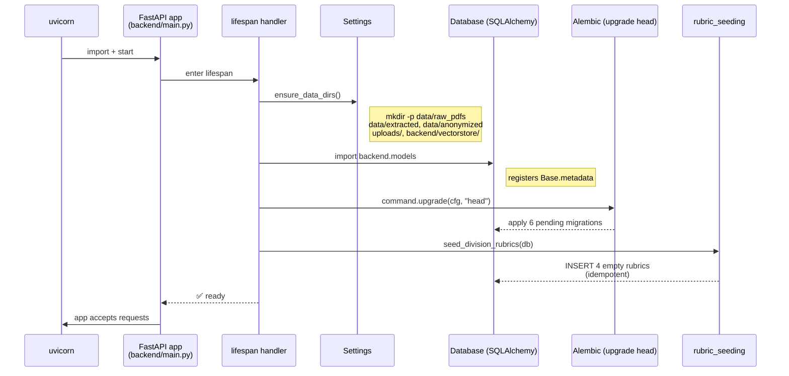
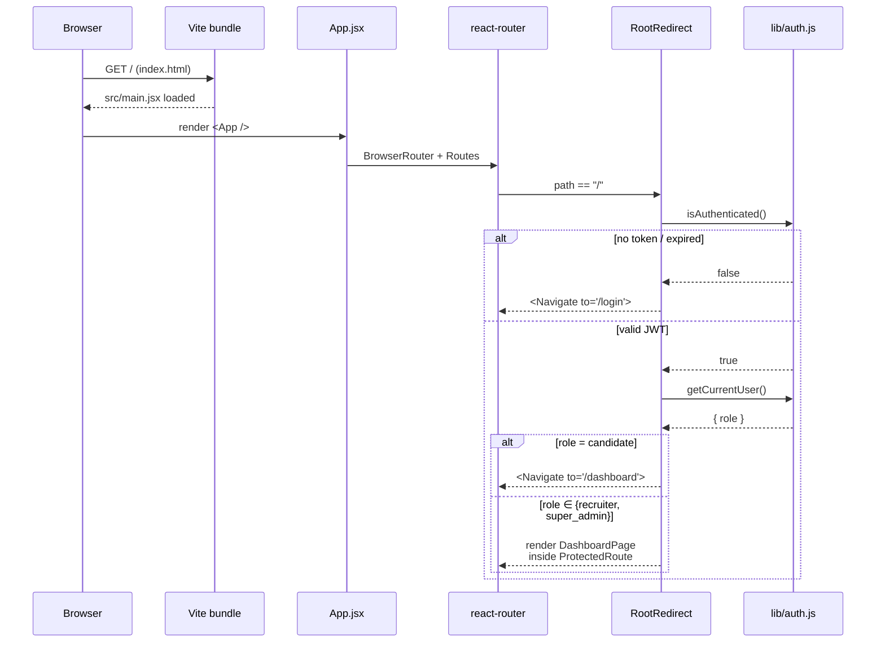
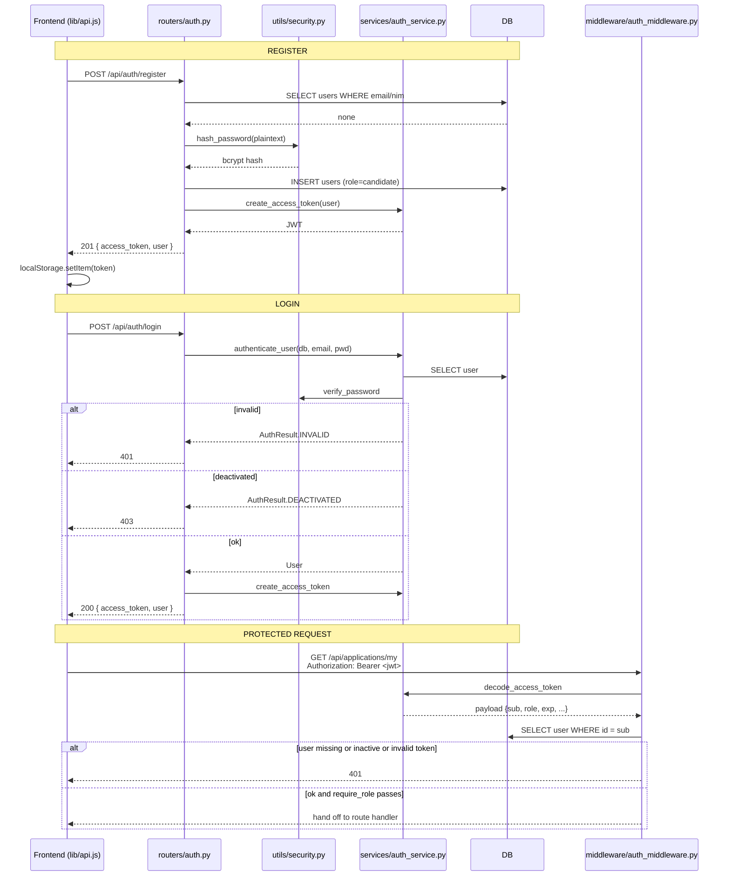
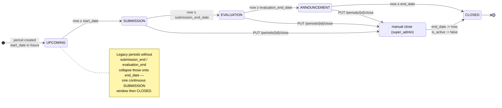
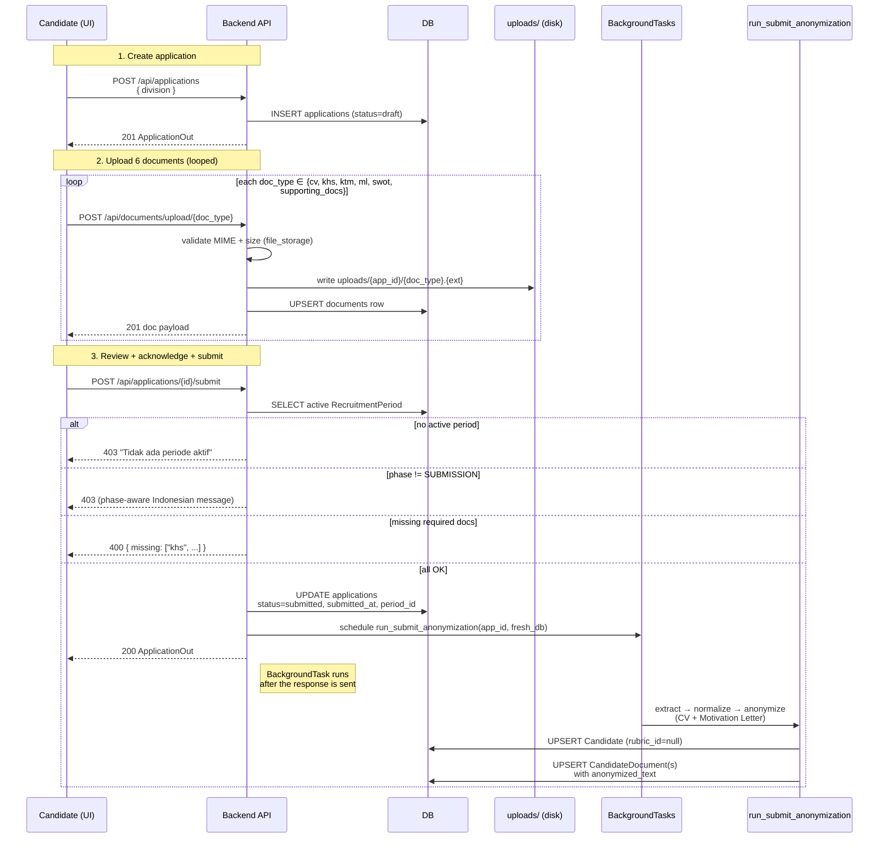
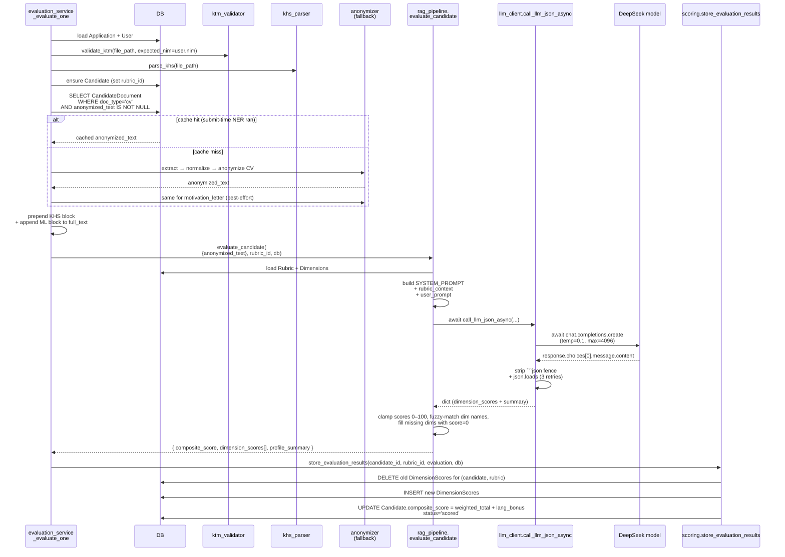
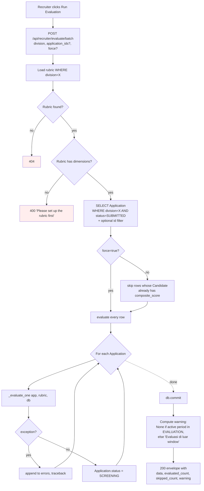
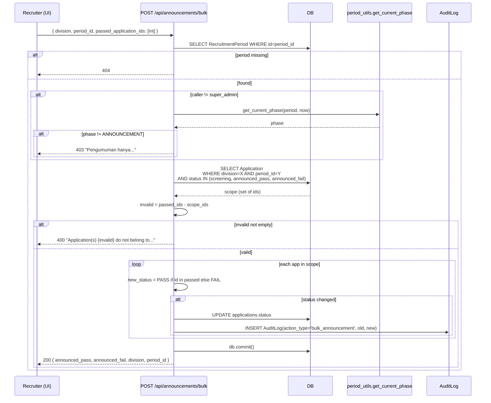
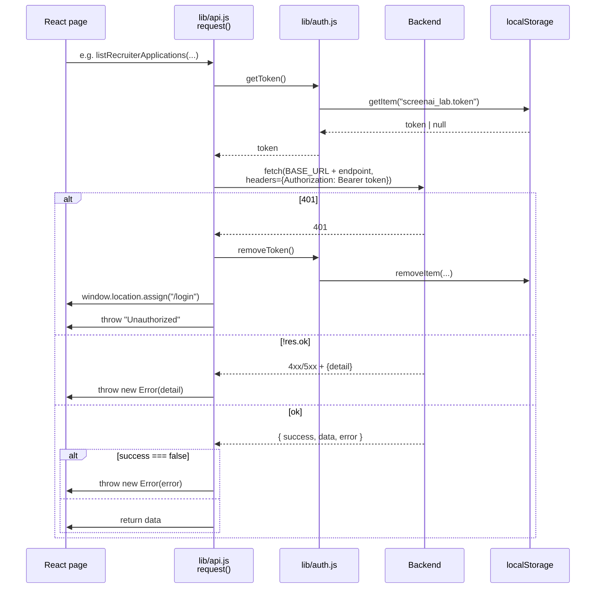

# Flow Diagrams

Mermaid diagrams covering the major runtime sequences in ScreenAI Lab.

> Render these in any Markdown viewer that supports Mermaid (GitHub, VSCode preview, MkDocs Material, etc.). Each diagram links back to the modules it depicts in [MODULE_ANALYSIS.md](MODULE_ANALYSIS.md) and the endpoints in [API_REFERENCE.md](API_REFERENCE.md).

---

## 1. Backend Bootstrap

What happens when uvicorn starts the FastAPI app. The lifespan hook ensures filesystem state, applies pending Alembic migrations, and idempotently seeds one empty rubric per division.



Source: [backend/main.py:33–66](../backend/main.py#L33), [backend/database.py::init_db](../backend/database.py#L50), [backend/services/rubric_seeding.py](../backend/services/rubric_seeding.py).

---

## 2. Frontend Bootstrap

Browser load → role-aware landing page. Recruiter / super_admin land on `/` and see `DashboardPage` directly; candidate lands on `/dashboard`.



Source: [frontend/src/App.jsx:175–192](../frontend/src/App.jsx#L175), [frontend/src/lib/auth.js](../frontend/src/lib/auth.js).

---

## 3. Auth Flow (Register / Login / Bearer)

End-to-end auth: registration creates a candidate, login returns a JWT, subsequent requests use the token, and protected routes go through `get_current_user` + (optionally) `require_role`.



Source: [backend/routers/auth.py](../backend/routers/auth.py), [backend/services/auth_service.py](../backend/services/auth_service.py), [backend/middleware/auth_middleware.py](../backend/middleware/auth_middleware.py), [backend/utils/security.py](../backend/utils/security.py).

---

## 4. RecruitmentPeriod Phase Transition

The phase is a pure function of `(period, now)` — derived in [period_utils.py](../backend/utils/period_utils.py). The state machine:



Phase semantics drive **gate enforcement** elsewhere:

| Phase | Submission | Evaluation | Bulk announcement |
|---|---|---|---|
| UPCOMING | 403 (period belum dibuka) | soft warn | 403 (super_admin bypass) |
| SUBMISSION | ✅ allowed | soft warn | 403 (super_admin bypass) |
| EVALUATION | 403 (pendaftaran ditutup) | ✅ "in window" | 403 (super_admin bypass) |
| ANNOUNCEMENT | 403 | soft warn | ✅ allowed |
| CLOSED | 403 (periode berakhir) | soft warn | 403 (super_admin bypass) |

Source: [backend/routers/applications.py:260](../backend/routers/applications.py#L260) (submit gate), [backend/routers/evaluate_batch.py:103](../backend/routers/evaluate_batch.py#L103) (soft-warn), [backend/routers/announcements.py:171](../backend/routers/announcements.py#L171) (bulk gate).

---

## 5. Candidate Submission Flow

End-to-end from "create application" to "submitted, NER scheduled".



Source: [backend/routers/applications.py:212–307](../backend/routers/applications.py#L212), [backend/services/submit_anonymization.py](../backend/services/submit_anonymization.py).

---

## 6. Document Anonymization Pipeline (submit-time)

Detail of the BackgroundTask that fires after a successful submit. Failures are logged but never raised (the server must keep running).

```mermaid
flowchart TD
    A[Submit committed → BackgroundTask fires] --> B[Load Application from fresh db session]
    B --> C{Application exists?}
    C -- no --> Z[log warning + return]
    C -- yes --> D[Ensure Candidate row<br/>rubric_id=None, status=anonymized]

    D --> E{For each doc_type<br/>in &#123;CV, MOTIVATION_LETTER&#125;}
    E --> F[Lookup Document for this app + doc_type]
    F --> G{Found and file exists on disk?}
    G -- no --> E
    G -- yes --> H[extract_text_from_pdf<br/>PyMuPDF .get_text&#40;'text'&#41;]
    H --> I{raw_text empty?}
    I -- yes --> E
    I -- no --> J[normalize_and_segment<br/>text cleanup + section split]
    J --> K[anonymize_text<br/>NER + regex + context patterns]
    K --> L[UPSERT CandidateDocument<br/>raw_text, normalized_text,<br/>anonymized_text, entities_json]
    L --> E

    E -. all docs processed .-> M[db.commit&#40;&#41;]
    M --> N[log: NER completed for app X]
    N --> Z2[finally: db.close&#40;&#41;]

    style A fill:#dff
    style Z fill:#fee
    style Z2 fill:#efe
```



Source: [backend/services/submit_anonymization.py](../backend/services/submit_anonymization.py), [backend/services/anonymizer.py](../backend/services/anonymizer.py), [backend/services/extractor.py](../backend/services/extractor.py).

---

## 7. RAG Query Flow (Evaluation per Candidate)

What `_evaluate_one` does for a single application. Note: rubric context is currently inlined into the prompt; ChromaDB is wired but not used for retrieval at this point.



Source: [backend/services/evaluation_service.py:165–325](../backend/services/evaluation_service.py#L165), [backend/services/rag_pipeline.py](../backend/services/rag_pipeline.py), [backend/services/scoring.py](../backend/services/scoring.py), [backend/utils/llm_client.py](../backend/utils/llm_client.py).

---

## 8. Batch Evaluation Flow (Recruiter-Initiated)

What happens when the recruiter clicks **Run Evaluation**.



Source: [backend/routers/evaluate_batch.py](../backend/routers/evaluate_batch.py), [backend/services/evaluation_service.py:49–158](../backend/services/evaluation_service.py#L49).

---

## 9. Bulk Announcement Flow

The recruiter selects passing candidates per division and clicks **Publish Hasil**. The endpoint is gated by phase (super_admin bypasses) and runs in a single transaction.



Source: [backend/routers/announcements.py:139–242](../backend/routers/announcements.py#L139).

---

## 10. Frontend Page Hierarchy

Component tree at runtime. Public auth pages render outside the `AuthenticatedShell`; everything else is wrapped in the sidebar layout.

```mermaid
graph TD
    Root[main.jsx] --> App[App.jsx]
    App --> BR[BrowserRouter]
    BR --> Routes
    Routes --> P[Public]
    Routes --> AS[AuthenticatedShell<br/>Sidebar + main]

    P --> Login[LoginPage]
    P --> Reg[RegisterPage]

    AS --> RR[RootRedirect /]
    AS --> CT[Candidate tree]
    AS --> RT[Recruiter tree]
    AS --> AT[Admin tree]

    CT --> CD[/dashboard - DashboardPage/]
    CT --> CP[/profile - ProfilePage/]
    CT --> CDoc[/documents - DocumentsPage]
    CT --> CR[/review - ReviewPage/]
    CT --> CS[/submitted - SubmittedPage/]
    CT --> CRes[/result - ResultPage/]
    CT --> CHist[/my-applications/]
    CT --> CUp[/upload - legacy/]

    RT --> RDash[/ - DashboardPage/]
    RT --> RRub[/rubrics - RubricConfigPage/]
    RT --> RDet[/candidates/:id - CandidateDetailPage/]
    RT --> RProf[/recruiter/profile/]

    AT --> AUsers[/admin/users - AdminPage/]
    AT --> APer[/admin/periods - RecruitmentPeriodPage/]
    AT --> AProf[/admin/profile/]

    CDoc -.uses.-> DUS[DocumentUploadStep × 6]
    RDet -.uses.-> OD[OverrideDialog]
    RDet -.uses.-> JC[JustificationCard]
    RDet -.uses.-> SHP[SwotHighlightPanel]

    CD -.uses.-> RPC[RecruitmentPhaseCard]
    CD -.uses.-> RJ[RecruitmentJourney]
    RDash -.uses.-> RPC
    AUsers -.uses.-> RPC
```

Every authenticated route is wrapped with `<ProtectedRoute roles={[...]}>` (see [App.jsx](../frontend/src/App.jsx)). The Sidebar nav set is derived from `getCurrentUser().role`.

Source: [frontend/src/App.jsx](../frontend/src/App.jsx), [frontend/src/components/](../frontend/src/components/).

---

## 11. API Client Request Lifecycle

How every frontend API call goes through the same wrapper.



Source: [frontend/src/lib/api.js:15–56](../frontend/src/lib/api.js#L15).

---

## 12. Composite Scoring Math

Reference for how the final composite score is built. Useful when reading override/recompute paths in [candidates.py](../backend/routers/candidates.py).

```
For one candidate against one rubric:

  weighted_score_d   = score_d × weight_d           # per dimension
  weighted_total     = Σ weighted_score_d
  language_bonus     = cefr_from_score(language_score)[1]    # 0, 2, 4, 6, 8

  composite_score    = round(weighted_total + language_bonus, 2)

EPrT TOTAL SCORE  →  CEFR  →  bonus
  ≤ 336                A1      0.0
  337-459              A2      2.0
  460-542              B1      4.0
  543-626              B2      6.0
  627-677              C1      8.0
  out of [310,677]     null    0.0  (rejected as invalid certificate)
```

Source: [backend/services/scoring.py:19–40](../backend/services/scoring.py#L19), [backend/services/rag_pipeline.py:166–230](../backend/services/rag_pipeline.py#L166).
